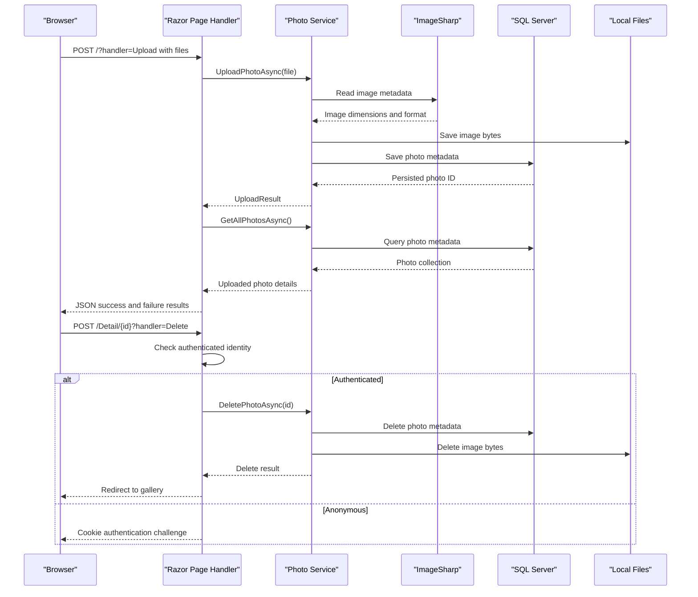

# API & Service Communication Contracts

The application exposes conventional Razor Page HTTP routes for the gallery, login, photo details, and file retrieval, plus JSON responses for uploads. Calls between page handlers and photo operations are synchronous in-process service calls; there are no remote service APIs or asynchronous messaging flows.

## Service Catalog

| Service | Port | Category | Purpose |
|---|---|---|---|
| PhotoAlbum | 5134 HTTP, 7055 HTTPS (development launch profile) | API Layer | Serves the photo gallery and handles photo operations |
| PhotoAlbum.Tests | N/A | Test project | Exercises application behavior; not independently deployed |

## API Endpoints Inventory

| Service | Method | Path | Request Type | Response Type |
|---|---|---|---|---|
| PhotoAlbum | GET | `/` | None | Gallery HTML |
| PhotoAlbum | POST | `/?handler=Upload` | Multipart form files (`List<IFormFile>`) | JSON upload result; 400 if no files |
| PhotoAlbum | GET | `/Detail/{id?}` | Optional route parameter `id` | Photo detail HTML; 404 if not found |
| PhotoAlbum | POST | `/Detail/{id}?handler=Delete` | Route parameter `id` | Redirect to gallery or detail |
| PhotoAlbum | GET | `/PhotoFile?id={id}` | Query parameter `id` | Photo bytes with stored MIME type; 404 if unavailable |
| PhotoAlbum | GET | `/Login` | None; optional `ReturnUrl` query | Login HTML |
| PhotoAlbum | POST | `/Login` | Form-bound username, password, optional return URL | Redirect after sign-in; login HTML on failure |
| PhotoAlbum | GET | `/Privacy` | None | Privacy page HTML |
| PhotoAlbum | GET | `/Error` | None | Error page HTML |

Razor Page named handlers are selected with the `handler` query parameter; the detail page also binds its optional `id` route segment.

## Management & Observability Endpoints

| Service | Endpoint | Custom Metrics (if any) |
|---|---|---|
| PhotoAlbum | No health, metrics, or Swagger endpoints identified | None |

## DTOs & Contracts

`UploadResult` is the service-level upload outcome returned to the gallery handler, which projects successful uploads and failures into an anonymous JSON response. `Photo` is the service-level domain entity used in page rendering and as the metadata model; it is not immutable. `IFormFile` is the upload request contract, while login values are form-bound properties on `LoginModel`. No gateway-level DTOs, OpenAPI specification, protobuf schema, or GraphQL schema were found. ASP.NET Core's default JSON serialization is used for the upload response.

## Communication Patterns

Page handlers make asynchronous direct method calls to the injected `IPhotoService`; the service accesses its database context and local files. No inter-service HTTP client, message broker, service discovery, API gateway, client-side load balancing, retry policy, or circuit breaker was identified. The application uses cookie authentication, and photo deletion requires an authenticated user; other gallery and upload handlers are not protected by an authorization policy. HTTPS redirection is configured in the request pipeline; certificate and TLS termination configuration is external to this application. Database migrations run during startup except when the test-environment flag is set, so database availability can affect application startup.

## Service Technology Matrix

| Service | Web | Data Access | Discovery | Gateway | Actuator | Cache | Metrics |
|---|---|---|---|---|---|---|---|
| PhotoAlbum | ASP.NET Core Razor Pages | EF Core SQL Server; local filesystem | None | None | None | HTTP response caching headers only | None |

## Service Communication Sequence

