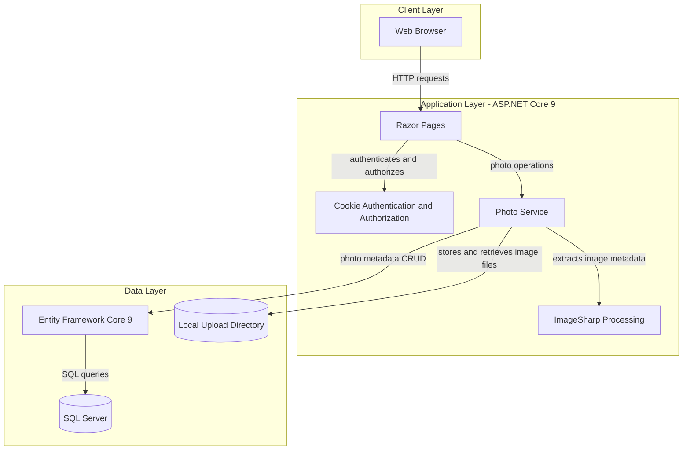
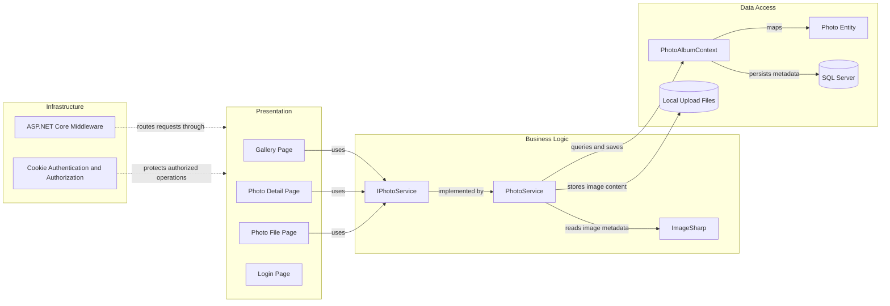

# Architecture Diagram

PhotoAlbum is an ASP.NET Core Razor Pages application for managing a photo gallery. It stores photo metadata in SQL Server and uploaded image files on the local filesystem.

## Application Architecture

### Technology Stack Summary

| Layer | Technology | Version | Purpose |
|---|---|---|---|
| Presentation | ASP.NET Core Razor Pages | 9.0 | Server-rendered gallery, photo detail, upload, and login pages |
| Business Logic | Photo service with dependency injection | .NET 9 | Validates and processes photo operations |
| Image Processing | SixLabors.ImageSharp | 3.1.11 | Reads image dimensions and processes uploaded images |
| Data Access | Entity Framework Core SQL Server | 9.0.9 | Persists and queries photo metadata |
| Database | SQL Server | Configured by connection string | Stores photo metadata |
| File Storage | Local filesystem | N/A | Stores uploaded image content under `wwwroot/uploads` |

### Data Storage & External Services

Photo metadata is persisted to SQL Server through Entity Framework Core. Photo content is saved to a local upload directory; the application does not consume the Azure Blob endpoint and container settings provisioned in infrastructure configuration. No cache, message broker, or external API integration is used by the runtime application.

### Key Architectural Decisions

- Razor Pages depend on the `IPhotoService` abstraction, separating presentation handlers from photo operations.
- Entity Framework Core is used through a scoped `PhotoAlbumContext` for metadata persistence.
- Photo metadata and image bytes use separate stores: SQL Server and the local filesystem.

## Component Relationships

### Component Inventory

| Component | Layer | Type | Responsibility |
|---|---|---|---|
| Gallery Page | Presentation | Razor Page | Lists photos and handles uploads |
| Photo Detail Page | Presentation | Razor Page | Displays photo details and management actions |
| Photo File Page | Presentation | Razor Page | Serves photo content |
| Login Page | Presentation | Razor Page | Authenticates administrator access |
| IPhotoService | Business Logic | Service interface | Defines photo retrieval, upload, and deletion operations |
| PhotoService | Business Logic | Service | Validates, processes, stores, and deletes photos |
| ImageSharp | Business Logic | Image processing library | Reads image metadata and dimensions |
| PhotoAlbumContext | Data Access | EF Core DbContext | Maps photo metadata and performs database operations |
| Photo | Data Access | Entity | Represents persisted photo metadata |
| SQL Server | Data Access | Relational database | Stores photo metadata |
| Local Upload Files | Data Access | Filesystem storage | Stores uploaded photo bytes |
| ASP.NET Core Middleware | Infrastructure | Request pipeline | Handles HTTPS, static files, routing, and errors |
| Cookie Authentication and Authorization | Infrastructure | Authentication services | Establishes user identity and protects authorized operations |
