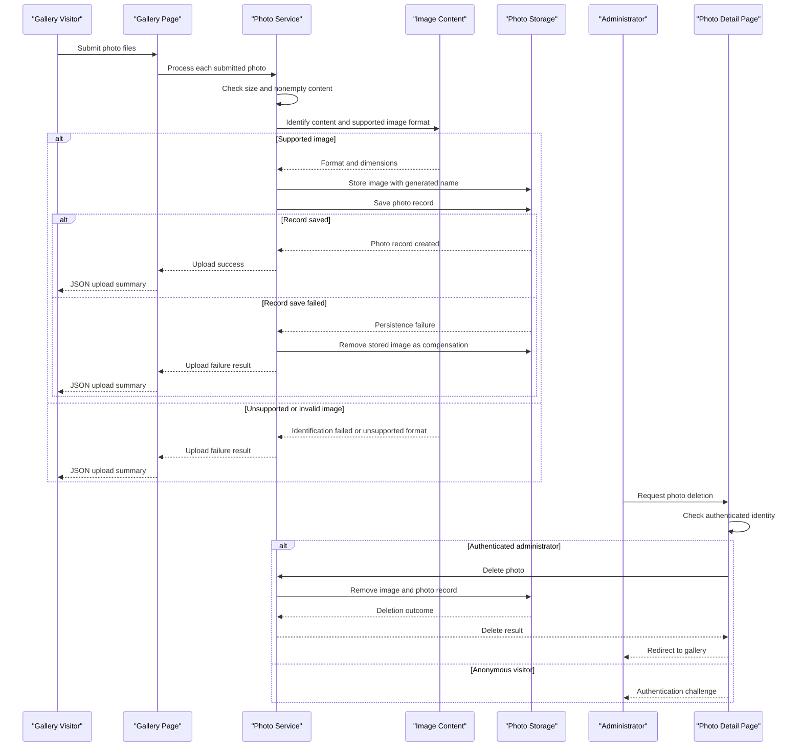

# Core Business Workflows

PhotoAlbum lets visitors browse a shared photo gallery and lets users submit image files for storage and display. Authenticated administrators can remove photos from the collection.

## Domain Entities

| Entity | Service / Bounded Context | Description | Key Relationships |
|---|---|---|---|
| Photo | PhotoAlbum / Photo Gallery | A gallery item representing an uploaded image and its displayable metadata | No related domain entities; the image bytes are stored separately from the photo record |

## Service-to-Domain Mapping

| Service | Domain Context | Owned Entities | External Dependencies |
|---|---|---|---|
| PhotoAlbum | Photo Gallery | Photo | SQL Server for photo records; local filesystem for image content |

The application has no cross-service data exchange or aggregation boundary.

## Primary Workflows

### Workflow 1: Upload a photo

1. A visitor submits one or more files from the gallery page.
2. The photo service checks that each file is nonempty and within the configured size limit, then identifies the actual image format from its contents.
3. If the content is not a supported raster image, the upload is rejected with a user-facing failure result.
4. For accepted content, the service stores it under a generated filename and creates the associated photo record.
5. If saving the photo record fails, the service attempts to remove the stored file as compensation.
6. The gallery handler returns a JSON summary of uploaded photos and failed uploads.

### Workflow 2: Delete a photo

1. An administrator submits the delete action from a photo detail page.
2. The page handler requires an authenticated identity; anonymous users receive an authentication challenge.
3. The photo service deletes the image file when possible, then removes the photo record.
4. If file deletion fails, the service logs the error and continues with metadata deletion; the page redirects to the gallery.

## Cross-Service Data Flows

No gateway composition or cross-service data flow exists. The photo service is the source of truth for photo metadata, and each image's bytes are managed as a local file by the same application. No downstream service fallback or asynchronous event flow was found.

## Business Workflow Sequence

## Business Rules & Decision Logic

- Uploads must be nonempty, within the configured size limit, and decodable as supported JPEG, PNG, GIF, or WebP raster images. The detected image format, rather than the submitted MIME type or filename extension, determines whether content is accepted.
- Stored filenames are generated by the application; metadata retains the original filename for display.
- A photo record is created only after the image has been written. On metadata-save failure, the service attempts to remove the file to avoid an orphan.
- Photo deletion requires an authenticated identity. File deletion failure is logged but does not prevent the metadata delete attempt.
- Photo upload, listing, retrieval, and deletion are service operations; no multi-service transaction or event choreography is present.
- Operational errors are logged, and upload failures are returned in the upload response; no business audit trail or state machine was identified.
