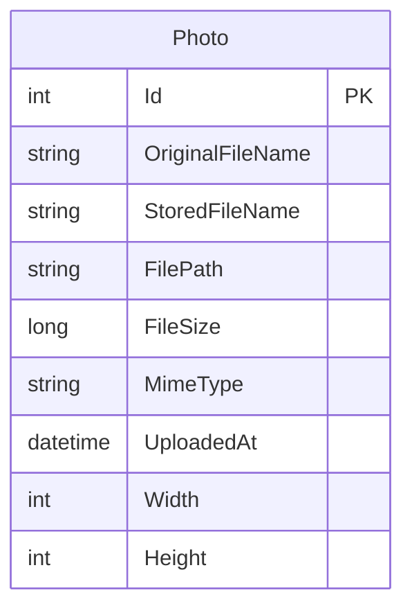

# Data Architecture & Persistence Layer

The application has one persisted domain entity managed by Entity Framework Core. Photo metadata is stored in SQL Server, while photo bytes are stored separately on the local filesystem.

## Database Configuration

| Service/Module | DB Type | Profile | Driver | Connection | Migration Tool |
|---|---|---|---|---|---|
| PhotoAlbum | SQL Server | Runtime configurations | EF Core SQL Server provider | Configured through the application connection string | EF Core Migrations; applied at startup except in test mode |
| PhotoAlbum.Tests | EF Core InMemory provider | Tests | EF Core InMemory | In-memory database configured by test host | None |

The application includes an initial EF Core migration. No seed-data mechanism was identified.

## Data Ownership per Service

| Service | Tables Owned | ORM Framework | Caching | Notes |
|---|---|---|---|---|
| PhotoAlbum | Photos | Entity Framework Core 9 | No data cache identified | Owns the metadata entity; image content is stored as local files |

## Entity Model

The `Photo` entity is defined in `PhotoAlbum/Models/Photo.cs` and mapped by `PhotoAlbum/Data/PhotoAlbumContext.cs`. No entity relationships are configured.

`PhotoAlbumContext` configures a descending index on upload time and required/max-length constraints for the stored name, original name, file path, and MIME type. The service uses EF Core `SaveChangesAsync` for persistence; no explicit `TransactionScope` or application-managed database transaction was identified.

## Key Repository Methods

| Service | Repository | Notable Methods | Purpose |
|---|---|---|---|
| PhotoAlbum | `PhotoAlbumContext` (`PhotoAlbum/Data/PhotoAlbumContext.cs`) | `Photos` DbSet | Exposes the photo entity set; no repository abstraction or custom repository query methods are present |
| PhotoAlbum | `PhotoService` (`PhotoAlbum/Services/PhotoService.cs`) | `GetAllPhotosAsync()`, `GetPhotoByIdAsync(int)`, `UploadPhotoAsync(IFormFile)`, `DeletePhotoAsync(int)` | Performs photo metadata queries, inserts, and deletes through EF Core |

The list query sorts by upload time descending, and the single-item query uses the entity key. No custom SQL, stored procedure, or cross-service bulk query was found.

## Caching Strategy

No database, query-result, or distributed data cache is configured. Photo-file responses set HTTP cache headers and an ETag; this is client/proxy response caching rather than a server-side data cache.

## Data Ownership Boundaries

PhotoAlbum is the only application service and exclusively owns its photo metadata in one SQL Server database. The corresponding image bytes reside in local filesystem storage rather than in the database. All database access is in-process through the service and DbContext; there are no cross-service queries, CQRS read models, or separate write/read stores.

### Data Classification & Sensitivity

| Entity | Sensitive Fields | Classification (PII/PHI/PCI/None) | Controls in Place |
|---|---|---|---|
| Photo | `OriginalFileName` may contain user-provided identifying information | Potential PII | No application-level encryption-at-rest or field masking identified; underlying database and filesystem storage controls are environment-dependent |

