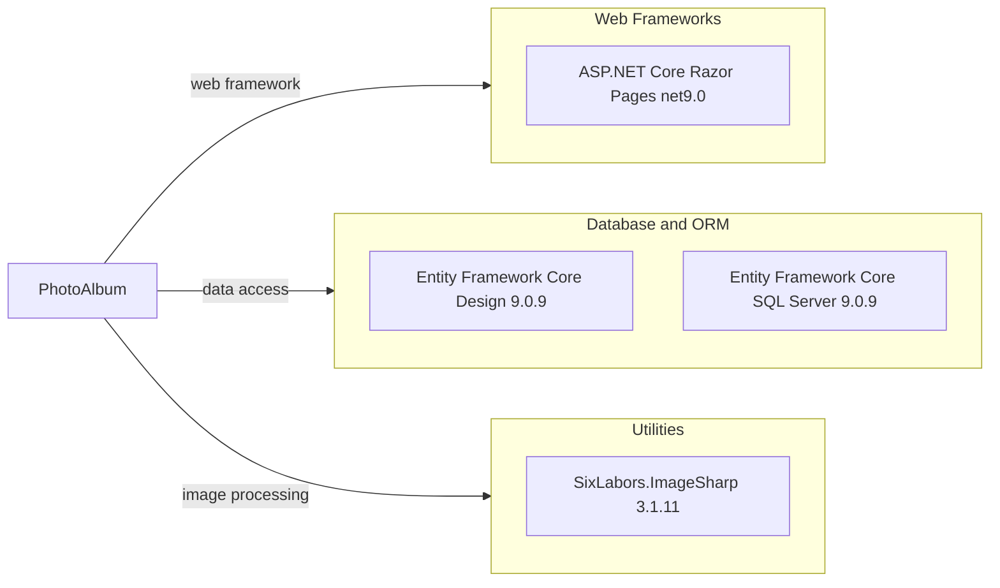

# Dependency Map

PhotoAlbum is a .NET 9 application with three direct runtime package dependencies and six test-scope packages declared across its two projects.

## Dependencies

### Dependency Summary

| Category | Count | Key Libraries | Notes |
|---|---:|---|---|
| Web Frameworks | 1 | ASP.NET Core Razor Pages net9.0 | Provided through the Web SDK and shared framework |
| Database and ORM | 2 | Entity Framework Core Design 9.0.9, Entity Framework Core SQL Server 9.0.9 | Design package is private to the application build |
| Utilities | 1 | SixLabors.ImageSharp 3.1.11 | Used for image processing |

### Version & Compatibility Risks

Both projects target .NET 9.0, whose support period ends in November 2026. The declared EF Core packages are on 9.0.9 and should remain aligned with the selected target framework; review available servicing releases and runtime support before deployment.

### Notable Observations

- EF Core Design is marked private and limits its assets to the relevant build and tooling categories.
- EF Core SQL Server and ImageSharp are the main direct runtime dependencies beyond the ASP.NET Core shared framework.
- Package references are declared independently in each project; no central package management file is present.

## Test Dependencies

| Framework | Version | Notes |
|---|---|---|
| coverlet.collector | 6.0.2 | Code coverage collector |
| Microsoft.AspNetCore.Mvc.Testing | 9.0.9 | ASP.NET Core integration test host |
| Microsoft.EntityFrameworkCore.InMemory | 9.0.9 | In-memory database provider |
| Microsoft.NET.Test.Sdk | 17.12.0 | .NET test runner integration |
| xunit | 2.9.2 | Test framework |
| xunit.runner.visualstudio | 2.8.2 | Visual Studio test adapter |

Total test-scope dependencies: 6

The project uses xUnit and ASP.NET Core integration testing with an in-memory EF Core provider. No package version centralization is present.
