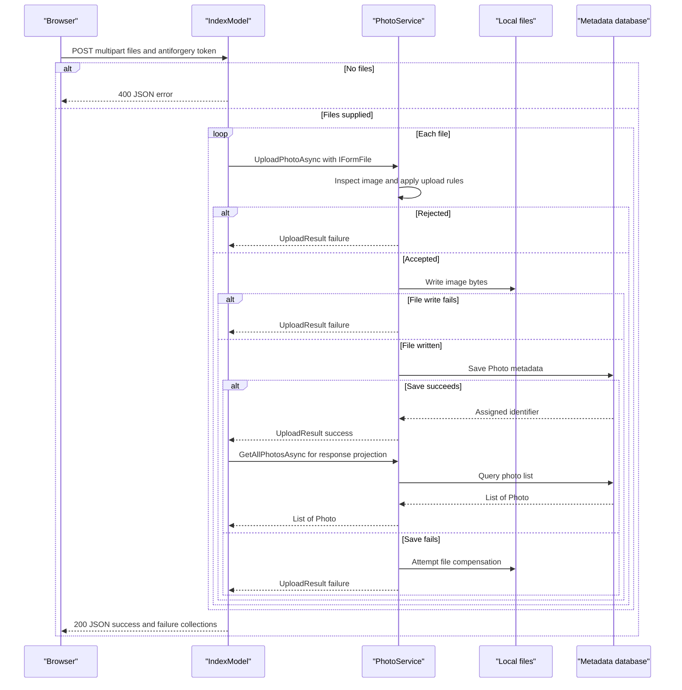

# API & Service Communication Contracts

The application exposes nine primary Razor Page HTTP operations, including a multipart upload returning JSON and an image-byte response. Communication is browser-to-server request/response with awaited in-process service calls, not inter-service messaging.

## Service Catalog

| Service | Port | Category | Purpose |
|---|---|---|---|
| PhotoAlbum (`PhotoAlbum.csproj`; azd service `web`) | Local HTTP 5134 / HTTPS 7055; container target 8080 | Business | Gallery, uploads, image retrieval and deletion; ASP.NET Core Web SDK, EF SQL provider and ImageSharp (`PhotoAlbum/Properties/launchSettings.json:8,17`, `Dockerfile:3`, `PhotoAlbum/PhotoAlbum.csproj:1-16`, `azure.yaml:7-14`). |
| Azure SQL resource (IaC, not another source service) | SQL TCP 1433 | Infrastructure | Configured cloud metadata store; `infra/main.bicep:56-87,117`. |
| Azure Blob Storage resource (IaC only integration) | HTTPS endpoint; port implicit | Infrastructure | Provisioned photos container; no application client implementation (`infra/main.bicep:89-112,147-153`, `PhotoAlbum/Services/PhotoService.cs:147-159`). |
| Azure Container Registry / Container Apps environment | Registry HTTPS; application ingress target 8080 | Infrastructure | Image distribution and hosting; `infra/main.bicep:32-54,162-178`. |
| Log Analytics workspace | Managed Azure service; no application listener | Observability | Platform log destination; no application metrics SDK (`infra/main.bicep:23-40`, `PhotoAlbum/PhotoAlbum.csproj:10-17`). |

`PhotoAlbum.Tests` is non-deployable test infrastructure, not an API service (`PhotoAlbum.Tests/PhotoAlbum.Tests.csproj:7,11-25`). Resource existence and successful live deployment are not verified.

## API Endpoints Inventory

| Service | Method | Path | Request Type | Response Type |
|---|---|---|---|---|
| PhotoAlbum / IndexModel | GET | `/`, `/Index` | None | 200 HTML gallery; load failure produces empty gallery (`PhotoAlbum/Pages/Index.cshtml:1-2`, `PhotoAlbum/Pages/Index.cshtml.cs:35-45`). |
| PhotoAlbum / IndexModel | POST | `/Index?handler=Upload` (root page alias also resolves handler) | Multipart `files`: `List<IFormFile>`; antiforgery token | 200 JSON anonymous batch result (`success`, `uploadedPhotos`, `failedUploads`); 400 JSON when no files; per-file rejection remains in 200 batch response (`PhotoAlbum/Pages/Index.cshtml.cs:53-101`, `PhotoAlbum/wwwroot/js/upload.js:97-115`). |
| PhotoAlbum / DetailModel | GET | `/Detail/{id:int?}` (query `id` also binds) | Nullable integer ID | 200 HTML detail/navigation; 404 missing ID, absent record or read failure (`PhotoAlbum/Pages/Detail.cshtml:1`, `PhotoAlbum/Pages/Detail.cshtml.cs:47-84`). |
| PhotoAlbum / DetailModel | POST | `/Detail/{id:int?}?handler=Delete` | Integer ID; antiforgery token; authenticated cookie | Cookie challenge redirects anonymous callers to login; 302 gallery redirect on normal completion, 302 detail redirect on caught failure (`PhotoAlbum/Pages/Detail.cshtml:27-29`, `PhotoAlbum/Pages/Detail.cshtml.cs:92-112`, `PhotoAlbum/Program.cs:13-18`). |
| PhotoAlbum / PhotoFileModel | GET | `/photo/{id:int}` | Integer route ID | 200 image `FileContentResult`; 404 missing metadata/file; 500 caught serving exception (`PhotoAlbum/Pages/PhotoFile.cshtml:1`, `PhotoAlbum/Pages/PhotoFile.cshtml.cs:37-82`). |
| PhotoAlbum / LoginModel | GET | `/Login` | Optional `ReturnUrl` query | 200 HTML login (`PhotoAlbum/Pages/Login.cshtml:1`, `PhotoAlbum/Pages/Login.cshtml.cs:31-38`). |
| PhotoAlbum / LoginModel | POST | `/Login` | Form-bound LoginModel properties; antiforgery token | 302 local-return/gallery redirect and cookie on success; 200 login HTML with error on failure (`PhotoAlbum/Pages/Login.cshtml.cs:25-75`). |
| PhotoAlbum / PrivacyModel | GET | `/Privacy` | None | 200 HTML information (`PhotoAlbum/Pages/Privacy.cshtml:1`, `PhotoAlbum/Pages/Privacy.cshtml.cs:15-17`). |
| PhotoAlbum / ErrorModel | GET | `/Error` | Request trace context | Error HTML; also nondevelopment exception re-execution target, not a health endpoint (`PhotoAlbum/Pages/Error.cshtml:1`, `PhotoAlbum/Pages/Error.cshtml.cs:7-25`, `PhotoAlbum/Program.cs:64-68`). |

The paths use Razor Page conventions and handler query selection, with no API versioning or controller-based REST API (`PhotoAlbum/Program.cs:9,88-90`). Static assets, including physically available upload files under the web root, are served separately by static middleware (`PhotoAlbum/Program.cs:73-81`); they are not counted as domain operations.

## Management & Observability Endpoints

| Service | Endpoint | Custom Metrics (if any) |
|---|---|---|
| PhotoAlbum | No health, readiness, Swagger, OpenAPI or metrics route registered in the composition root | No custom metric registration found; ILogger diagnostics and error trace ID only (`PhotoAlbum/Program.cs:8-34,63-90`, `PhotoAlbum/Pages/Error.cshtml.cs:22-24`). |
| Declared cloud environment | No application management route evidenced | IaC attaches Log Analytics to the hosting environment, not an application metrics exporter (`infra/main.bicep:23-40`). |

## DTOs & Contracts

- `IFormFile` is the framework upload request contract; the handler accepts a list. `UploadResult` is a mutable service-level outcome class, not the serialized batch response (`PhotoAlbum/Services/IPhotoService.cs:28`, `PhotoAlbum/Models/UploadResult.cs:6-26`).
- `Photo` is a mutable domain entity used for server-rendered views and projected anonymous upload responses; see [data-architecture.md](data-architecture.md) for entity fields and persistence (`PhotoAlbum/Pages/Index.cshtml.cs:30,69-83`).
- `IndexModel`, `DetailModel`, `PhotoFileModel` and `LoginModel` are mutable page/binding models, not versioned public DTO schemas. The login model handles request form data; photo serving returns bytes, not a JSON entity.
- The batch response contract is anonymous: a success flag and success/failure collections. Failure entries expose original request filename and a user-facing error. This is composition of operations within one service, not gateway-level aggregation (`PhotoAlbum/Pages/Index.cshtml.cs:60-101`).
- JSON uses framework `JsonResult` defaults; no custom serializer, OpenAPI, protobuf or GraphQL contract is registered in the inspected application (`PhotoAlbum/Pages/Index.cshtml.cs:96-101`, `PhotoAlbum/Program.cs:8-34`). No immutable record DTOs were found in the two model definitions.

## Communication Patterns

Browser Fetch requests and HTML forms are synchronous HTTP request/response. Async C# methods await local service, EF and file operations; they are not queue-based or fire-and-forget communication. The page-to-service calls are direct DI method calls (`PhotoAlbum/wwwroot/js/upload.js:108-140`, `PhotoAlbum/Pages/Index.cshtml.cs:63-70`, `PhotoAlbum/Services/PhotoService.cs:43-65,155-186`). There is no gateway, service discovery client, client load balancer, broker, circuit breaker, custom application retry policy or explicit request timeout in these paths. Cloud SQL connection establishment has a declared 30-second timeout; no EF `EnableRetryOnFailure` or command timeout is configured (`infra/main.bicep:117`, `PhotoAlbum/Program.cs:22-23`).

Upload failures are reported per file; a post-save metadata lookup can still throw outside the service's upload error handling. Gallery failures degrade to an empty page; detail read failures become 404; file-serving exceptions become 500. Deletion catches failures and redirects, and does not turn a service-level not-found result into 404 (`PhotoAlbum/Pages/Index.cshtml.cs:35-45,63-101`, `PhotoAlbum/Pages/Detail.cshtml.cs:80-112`, `PhotoAlbum/Pages/PhotoFile.cshtml.cs:78-82`).

Cookie authentication is registered; deletion checks only `IsAuthenticated`, not an explicit Admin role or photo ownership policy. Login issues an Admin role claim, but gallery, uploads and image reads have no authentication requirement. Razor forms use antiforgery tokens; the error model opts out. HTTPS redirection is enabled and HSTS is nondevelopment-only; IaC declares external ingress and an HTTPS output URL, but live TLS behavior is not verified (`PhotoAlbum/Program.cs:13-19,64-86`, `PhotoAlbum/Pages/Detail.cshtml.cs:94-99`, `PhotoAlbum/Pages/Login.cshtml.cs:60-68`, `PhotoAlbum/Pages/Index.cshtml:16-17`, `PhotoAlbum/Pages/Error.cshtml.cs:8`, `infra/main.bicep:173-174,229`).

API availability depends on successful startup migration except when the test bypass is explicitly set. See [configuration-inventory.md](configuration-inventory.md) for startup order and [business-workflows.md](business-workflows.md) for validation rules.

## Service Technology Matrix

| Service | Web | Data Access | Discovery | Gateway | Actuator | Cache | Metrics |
|---|---|---|---|---|---|---|---|
| PhotoAlbum | Razor Pages | EF Core SQL Server | None | None | No mapped health checks | HTTP caching only; no application cache | ILogger; no exporter |
| Declared Azure infrastructure | Container Apps ingress | Azure SQL resource; Blob unused by application | No app discovery registration | No gateway resource | No custom app probe declared | None declared | Hosting environment Log Analytics |

Evidence: `PhotoAlbum/Program.cs:8-34,73-90`, `PhotoAlbum/Pages/PhotoFile.cshtml.cs:72-76`, `infra/main.bicep:23-40,119-179`.

## Service Communication Sequence

Flow evidence: `PhotoAlbum/Pages/Index.cshtml.cs:53-101`, `PhotoAlbum/Services/PhotoService.cs:77-221`. Dashed arrows represent responses, not an asynchronous broker.
