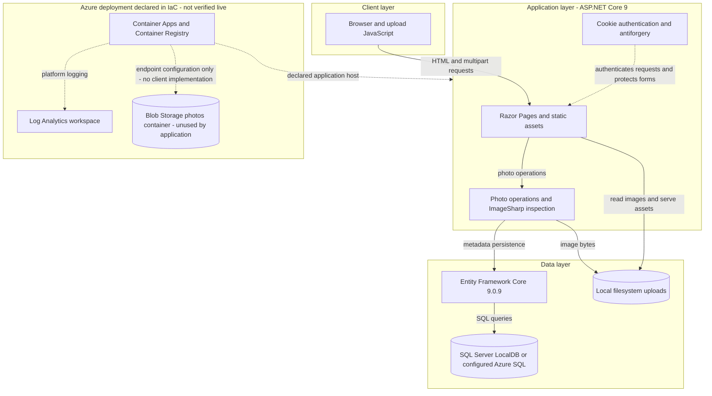
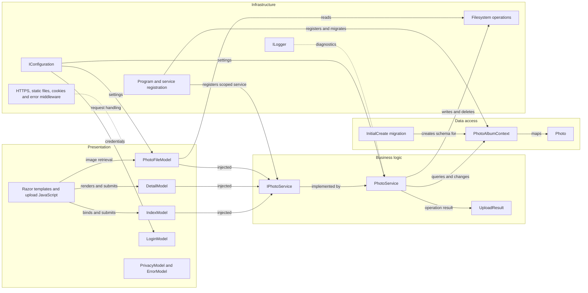

# Architecture Diagram

PhotoAlbum is a layered, single-process web application with relational photo metadata and local image files. Azure provisioning artifacts describe a cloud deployment, but provisioning Blob Storage does not establish an application storage integration.

## Application Architecture

### Technology Stack Summary

| Layer | Technology | Version | Purpose |
|---|---|---|---|
| Presentation | ASP.NET Core Razor Pages, cookie authentication | .NET 9 target | HTML pages, form handlers and JSON upload results; `PhotoAlbum/PhotoAlbum.csproj:1-6`, `PhotoAlbum/Program.cs:9-19`. |
| Browser | JavaScript Fetch API and local CSS/JS assets | No frontend package manifest version declared | Multipart uploads and gallery updates; `PhotoAlbum/wwwroot/js/upload.js:90-140`. |
| Business | SixLabors.ImageSharp | 3.1.11 | Content-based image format and dimension inspection; `PhotoAlbum/PhotoAlbum.csproj:16`, `PhotoAlbum/Services/PhotoService.cs:107-144`. |
| Data access | EF Core SQL Server provider and design tooling | 9.0.9 | Metadata queries and schema migrations; `PhotoAlbum/PhotoAlbum.csproj:11-15`, `PhotoAlbum/Program.cs:22-23`. |
| Hosting | .NET ASP.NET runtime and SDK container images | 9.0 tags | Multi-stage Release build and application execution; `Dockerfile:1-19`. |
| Cloud infrastructure | Azure Container Apps, ACR, Azure SQL, Storage, Log Analytics | AVM versions pinned in IaC | Declared deployment resources, not verified running resources; `infra/main.bicep:23-119`. |
| Tests | xUnit and EF Core InMemory | 2.9.2 / 9.0.9 | Separate non-deployable test project; `PhotoAlbum.Tests/PhotoAlbum.Tests.csproj:11-16`. |

### Data Storage & External Services

SQL Server is the sole application database provider; the default configuration targets LocalDB, while deployment artifacts inject an Azure SQL connection. Image upload, retrieval and deletion use filesystem APIs, not Blob Storage (`PhotoAlbum/Program.cs:22-23`, `PhotoAlbum/appsettings.json:2-4`, `PhotoAlbum/Services/PhotoService.cs:147-159,238-255`, `PhotoAlbum/Pages/PhotoFile.cshtml.cs:55-76`). IaC declares a private `photos` blob container, its endpoint variables and an identity role assignment, but no Azure storage SDK is declared and no blob operations appear in the storage implementation (`infra/main.bicep:89-112,141-153,196-205`, `PhotoAlbum/PhotoAlbum.csproj:10-17`). No application cache, message broker or remote API client is identified. Cloud resources and platform logging are deployment intent, not evidence of successful deployment or application telemetry instrumentation.

### Key Architectural Decisions

- Constructor injection and a scoped `IPhotoService` separate page handlers from photo operations; the implementation directly uses the DbContext rather than a separate repository (`PhotoAlbum/Program.cs:25-26`, `PhotoAlbum/Services/PhotoService.cs:25-38`).
- Image bytes and metadata are separate persistence domains; upload attempts file compensation on database failure, rather than a distributed transaction (`PhotoAlbum/Services/PhotoService.cs:182-211`).
- The gallery and upload are public; deletion explicitly challenges anonymous callers. Startup applies migrations in every environment unless the test flag is set (`PhotoAlbum/Pages/Detail.cshtml.cs:92-105`, `PhotoAlbum/Program.cs:45-61`).

## Component Relationships

### Component Inventory

| Component | Layer | Type | Responsibility |
|---|---|---|---|
| IndexModel | Presentation | PageModel | Gallery and batch upload responses; `PhotoAlbum/Pages/Index.cshtml.cs:35-101`. |
| DetailModel | Presentation | PageModel | Navigation and authenticated delete; `PhotoAlbum/Pages/Detail.cshtml.cs:47-112`. |
| PhotoFileModel | Presentation | PageModel | Metadata-backed local file response; `PhotoAlbum/Pages/PhotoFile.cshtml.cs:37-82`. |
| LoginModel | Presentation | PageModel | Configuration-backed admin login and cookie issuance; `PhotoAlbum/Pages/Login.cshtml.cs:40-75`. |
| PrivacyModel / ErrorModel | Presentation | PageModels | Informational page and correlated error display; `PhotoAlbum/Pages/Privacy.cshtml.cs:8-17`, `PhotoAlbum/Pages/Error.cshtml.cs:7-25`. |
| Razor templates / upload.js | Presentation | Views / browser code | Forms, gallery, detail and Fetch upload; `PhotoAlbum/Pages/Index.cshtml:16-28,60-82`, `PhotoAlbum/wwwroot/js/upload.js:90-140`. |
| IPhotoService / PhotoService | Business | Interface / scoped service | Read, inspect, store and delete photos; `PhotoAlbum/Services/IPhotoService.cs:8-35`, `PhotoAlbum/Services/PhotoService.cs:12-38`. |
| UploadResult | Business | Mutable transfer class | Per-file operation outcome; `PhotoAlbum/Models/UploadResult.cs:6-26`. |
| PhotoAlbumContext / Photo | Data access | DbContext / entity | Metadata and chronological index; `PhotoAlbum/Data/PhotoAlbumContext.cs:9-58`, `PhotoAlbum/Models/Photo.cs:8-64`. |
| InitialCreate | Data access | EF migration | Initial metadata schema; `PhotoAlbum/Migrations/20250930101715_InitialCreate.cs:12-38`. |
| Program / middleware | Infrastructure | Composition root / pipeline | DI, local directory, migrations, HTTPS, cookies and assets; `PhotoAlbum/Program.cs:6-90`. |
| IConfiguration / ILogger / filesystem APIs | Infrastructure | Framework abstractions / local IO | Settings, diagnostics and local image persistence; `PhotoAlbum/Services/PhotoService.cs:14-38,153-159,238-255`. |
