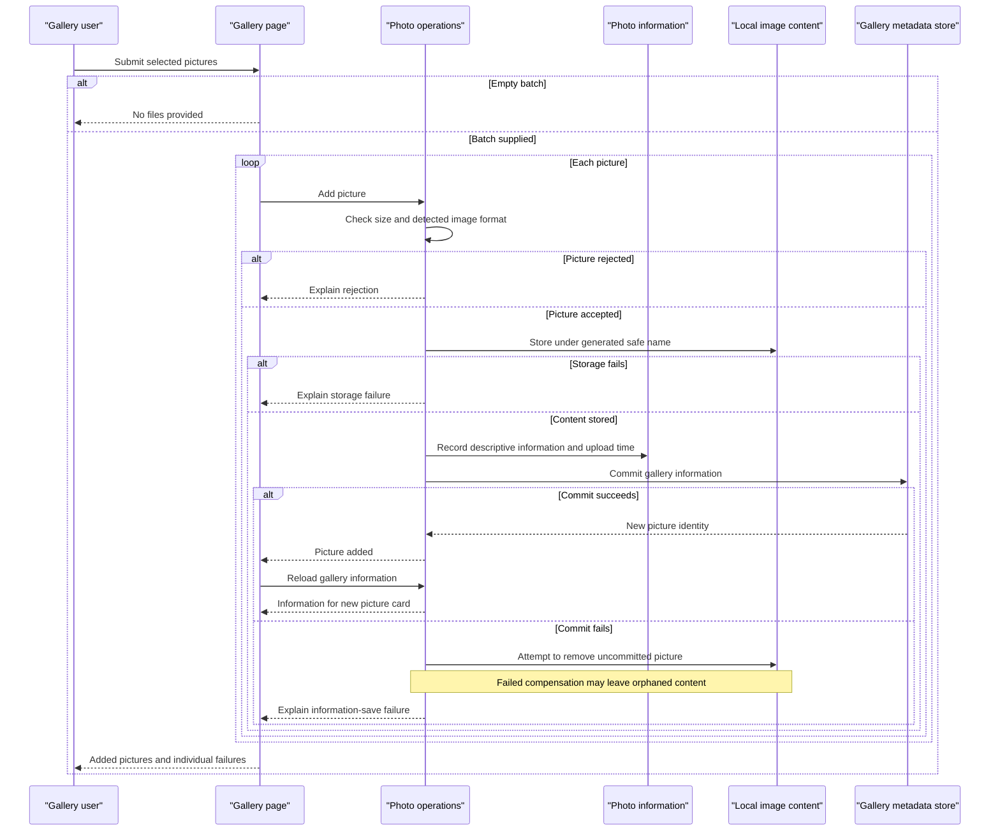

# Core Business Workflows

Users add photos to a shared gallery, browse them with chronological navigation, and view their image content and descriptive information. A configured administrator can sign in to delete photos; there are no separate user-owned albums or photo ownership boundaries.

## Domain Entities

| Entity | Service / Bounded Context | Description | Key Relationships |
|---|---|---|---|
| Photo | PhotoAlbum / gallery management | An uploaded picture and the information required to display/manage it | Associated local image content; no other domain entity relationships (`PhotoAlbum/Models/Photo.cs:5-64`, `PhotoAlbum/Services/PhotoService.cs:169-180`). |

`UploadResult` is an operation outcome, not a domain entity. The administrator is configuration-backed and represented by login claims rather than a persisted account entity (`PhotoAlbum/Models/UploadResult.cs:3-26`, `PhotoAlbum/Pages/Login.cshtml.cs:42-68`). Persistence fields are documented in [data-architecture.md](data-architecture.md).

## Service-to-Domain Mapping

| Service | Domain Context | Owned Entities | External Dependencies |
|---|---|---|---|
| PhotoAlbum / PhotoService | Shared gallery lifecycle | Photo | Metadata database, local image files and image inspection; no separate domain service (`PhotoAlbum/Services/PhotoService.cs:12-38,107-186`). |
| PhotoAlbum / LoginModel | Administrator access | No persisted account entity | Externally supplied credentials and authentication cookie (`PhotoAlbum/Pages/Login.cshtml.cs:40-75`). |
| PhotoAlbum.Tests | Verification, not a business context | Isolated test data only | In-memory test context (`PhotoAlbum.Tests/Unit/Services/PhotoServiceTests.cs:22-52`). |

The application is the sole source of truth for gallery metadata; cloud provisioning components are not additional business contexts.

## Primary Workflows

### Workflow 1: Add photos with per-file success and compensation

1. The gallery form or drop zone supplies multiple selected files. Browser prechecks run **Client upload rules**, then submit accepted files with an antiforgery token (`PhotoAlbum/wwwroot/js/upload.js:60-115`, `PhotoAlbum/Pages/Index.cshtml:16-28`).
2. The upload handler rejects an empty batch through **Batch presence rule**, then processes each file sequentially. There is no atomic batch commit (`PhotoAlbum/Pages/Index.cshtml.cs:53-65`).
3. The photo service applies **Server size rule**, **Content format rule** and **Safe identity rule**; rejected items produce user-facing outcomes without proceeding to storage (`PhotoAlbum/Services/PhotoService.cs:89-145`).
4. Accepted content is copied to local storage and descriptive information is persisted. A file-write failure produces a failed item; a metadata-save failure attempts **Upload compensation rule** (`PhotoAlbum/Services/PhotoService.cs:147-211`).
5. After each successful save, the handler reloads the full gallery to find the new photo and construct the success result. Successes and failures are returned together and the browser updates the gallery (`PhotoAlbum/Pages/Index.cshtml.cs:67-101`, `PhotoAlbum/wwwroot/js/upload.js:119-140,144-167`). A read exception at this post-save step is not caught by the upload handler, so a saved photo can exist even when the batch response fails.

### Workflow 2: Browse and navigate photos

1. The gallery loads photos under **Newest-first rule**. A database read failure logs an error and displays an empty gallery rather than distinguishing service failure from no photos (`PhotoAlbum/Pages/Index.cshtml.cs:35-45`, `PhotoAlbum/Services/PhotoService.cs:43-54`).
2. Selecting a photo reloads the complete list, finds the requested picture and computes neighbors under **Chronological navigation rule**. Missing IDs/records or caught read failures appear as not found (`PhotoAlbum/Pages/Detail.cshtml.cs:47-84`).
3. The image-serving page resolves metadata, locates local bytes and returns them; missing records or files are not found, other serving exceptions yield an error (`PhotoAlbum/Pages/PhotoFile.cshtml.cs:37-82`).
4. The detail view presents derived sizes/aspect ratios under **Display calculations rule**. Browser/intermediary caching can reduce repeat image transfers; see [data-architecture.md](data-architecture.md) for caching implementation (`PhotoAlbum/Pages/Detail.cshtml:104-139`).

### Workflow 3: Sign in and delete a photo

1. A user supplies credentials to the login form. **Configured administrator rule** fails closed if the account password is absent and returns a login error for mismatched credentials (`PhotoAlbum/Pages/Login.cshtml.cs:40-58`).
2. On success the application issues an authenticated cookie with an Admin role claim and applies **Local return rule** to navigation (`PhotoAlbum/Pages/Login.cshtml.cs:60-75`).
3. The detail form prompts for browser confirmation and submits with antiforgery protection. **Authenticated deletion rule** challenges anonymous callers before calling the service (`PhotoAlbum/Pages/Detail.cshtml:27-29`, `PhotoAlbum/Pages/Detail.cshtml.cs:92-99`).
4. The service finds the photo, attempts to remove local content, then removes metadata under **Deletion consistency rule**. Missing metadata returns false; the page ignores this result and still redirects to the gallery (`PhotoAlbum/Services/PhotoService.cs:227-258`, `PhotoAlbum/Pages/Detail.cshtml.cs:101-105`).
5. A thrown failure sends the user back to the detail page with a retry message; removal of the local content is not undone if the database deletion fails (`PhotoAlbum/Pages/Detail.cshtml.cs:107-112`, `PhotoAlbum/Services/PhotoService.cs:238-263`).

No scheduler, event listener, background business job or cross-service orchestrator is registered in the composition root (`PhotoAlbum/Program.cs:8-34`). Startup migrations establish schema, not seeded business state.

## Cross-Service Data Flows

There are no business-to-business remote service calls, gateway-composed responses or cross-context joins. Gallery metadata and image bytes are combined within the same application, using the photo identity to associate data with local content (`PhotoAlbum/Services/PhotoService.cs:143-180`, `PhotoAlbum/Pages/PhotoFile.cshtml.cs:47-67`).

Azure SQL can serve the same metadata context through deployed connection settings, but the Azure `photos` blob container is only provisioned: current uploads, reads and deletes remain local. There is no blob fallback, event-driven replication or synchronization workflow (`infra/main.bicep:141-153`, `PhotoAlbum/Services/PhotoService.cs:155-159,238-255`). Business degradation is local error handling: empty gallery on read failure, per-file failed uploads, and best-effort upload compensation. No circuit breaker implements these outcomes.

## Business Workflow Sequence

Evidence: `PhotoAlbum/Pages/Index.cshtml.cs:53-101`, `PhotoAlbum/Services/PhotoService.cs:77-221`. This shows synchronous business coordination with response arrows, not asynchronous messaging.

## Business Rules & Decision Logic

| Rule | Decision / constraint | Evidence |
|---|---|---|
| Client upload rules | Browser allows JPEG, PNG, GIF and WebP MIME types and files up to 10 MiB; prechecks are not authoritative server validation | `PhotoAlbum/wwwroot/js/upload.js:65-79`. |
| Batch presence rule | Missing/empty collection is rejected. Each item is processed independently; the configured ten-file setting is not enforced in this handler | `PhotoAlbum/Pages/Index.cshtml.cs:53-65`, `PhotoAlbum/appsettings.json:13`. |
| Server size rule | Reject zero/negative length or length over configured limit (default 10 MiB). Framework multipart parsing also has separate hardcoded limits | `PhotoAlbum/Services/PhotoService.cs:35,89-105`, `PhotoAlbum/Program.cs:29-34`. |
| Content format rule | ImageSharp identifies content; unknown/unreadable image metadata or canonical extension outside jpg/jpeg/png/gif/webp is rejected. Client filename and MIME type do not determine stored format. Loaded MIME allowlist is not used for this decision | `PhotoAlbum/Services/PhotoService.cs:21-23,36-37,107-141`. |
| Safe identity rule | Generate GUID filename with detected format extension; preserve only basename of original filename; record detected MIME/dimensions and UTC upload time | `PhotoAlbum/Services/PhotoService.cs:143-179`. |
| Metadata shape rule | Entity declares required names/path/MIME/timestamp/size, maximum string lengths 255/255/500/50 and a positive-size annotation. Entity annotations are not explicitly evaluated with a model validator in the upload service; EF/schema constraints are a separate enforcement layer | `PhotoAlbum/Models/Photo.cs:18-64`, `PhotoAlbum/Services/PhotoService.cs:169-186`. |
| Upload compensation rule | If metadata save fails after file creation, attempt file deletion; failed cleanup is logged. File-copy failure can leave a partial file because that branch does not clean up | `PhotoAlbum/Services/PhotoService.cs:155-167,194-211`. |
| Newest-first rule | Sort gallery descending by upload timestamp; no pagination or tie-breaker specified | `PhotoAlbum/Services/PhotoService.cs:43-49`. |
| Chronological navigation rule | Next means newer; Previous means older. Links are absent at collection boundaries | `PhotoAlbum/Pages/Detail.cshtml.cs:64-76`. |
| Display calculations rule | Format byte sizes as bytes/KB/MB, reduce aspect ratio by greatest common divisor, and label approximate 16:9 / 4:3 ratios within 0.1 | `PhotoAlbum/Pages/Detail.cshtml:104-139`. |
| Configured administrator rule | Username comparison is ordinal; password comparison uses fixed-time byte comparison. Missing configured password fails closed; successful login receives Admin role | `PhotoAlbum/Pages/Login.cshtml.cs:42-68,78-82`. |
| Local return rule | Only locally validated ReturnUrl is followed; otherwise redirect to gallery | `PhotoAlbum/Pages/Login.cshtml.cs:70-75`. |
| Authenticated deletion rule | Require authenticated identity; no explicit Admin-role check or per-photo ownership check is performed. Browsing and upload remain public | `PhotoAlbum/Pages/Detail.cshtml.cs:94-99`, `PhotoAlbum/Pages/Index.cshtml.cs:35-65`. |
| Deletion consistency rule | Missing metadata yields false; file-delete failure is logged but does not prevent metadata deletion; database failure after file removal has no restoration | `PhotoAlbum/Services/PhotoService.cs:231-263`. |

**State and transactions:** Photos have no persisted status state machine: operationally they move from submitted content to stored content plus metadata, then deletion. Individual EF saves provide database-level change persistence, but no distributed transaction or saga coordinates SQL and local files; a batch can partially succeed (`PhotoAlbum/Services/PhotoService.cs:182-211,238-255`).

**Errors, audit and authorization:** Rejections, successful uploads/deletes and caught errors are logged; the timestamp is descriptive upload history, not an immutable audit trail. There is no persisted actor/ownership audit record. Page forms use antiforgery tokens, and anonymous delete challenges use cookie authentication; resource-level authorization is absent (`PhotoAlbum/Services/PhotoService.cs:94-95,191-218,249-263`, `PhotoAlbum/Models/Photo.cs:8-64`, `PhotoAlbum/Pages/Index.cshtml:16-17`, `PhotoAlbum/Pages/Detail.cshtml:27-29`).
