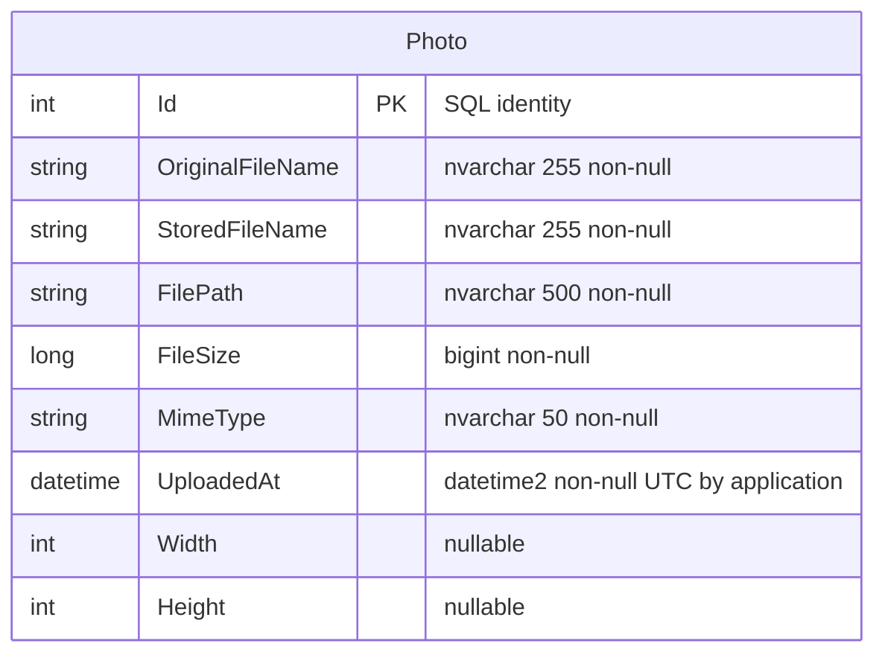

# Data Architecture & Persistence Layer

The data layer contains one EF Core entity and a SQL Server metadata store, with photo bytes stored separately on local disk. Tests directly construct an EF InMemory context rather than exercising a relational database.

## Database Configuration

| Service/Module | DB Type | Profile | Driver | Connection | Migration Tool |
|---|---|---|---|---|---|
| PhotoAlbum | SQL Server LocalDB | Default / Development unless overridden | EF Core SQL Server 9.0.9 | Local trusted connection with multiple active result sets; no custom pooling options | EF migrations, applied during startup; `PhotoAlbum/appsettings.json:2-4`, `PhotoAlbum/Program.cs:22-23,45-61`. |
| PhotoAlbum | Azure SQL | Production deployment intent | Same EF provider; underlying SQL client handles directory authentication | IaC/scripts supply encrypted TCP connection with directory-default authentication and 30-second connect timeout | Same startup EF migrations; successful live connectivity unverified (`infra/main.bicep:56-87,117,141-145`, `deploy-to-azure.sh:111-112,162-166`). |
| PhotoAlbum.Tests | EF InMemory store | Unit-test fixture, not a runtime database profile | EF Core InMemory 9.0.9 | Unique named in-process database per fixture | No relational schema migration in fixture (`PhotoAlbum.Tests/Unit/Services/PhotoServiceTests.cs:22-28`, `PhotoAlbum.Tests/PhotoAlbum.Tests.csproj:13`). |

The initial migration creates the metadata table and chronological index; no seed data is present in that migration. Runtime migration is skipped only by an explicit test flag, not automatically by Development/Production selection (`PhotoAlbum/Migrations/20250930101715_InitialCreate.cs:12-38`, `PhotoAlbum/Program.cs:45-61`). No raw SQL, stored procedures, explicit pooling tuning or additional database provider is configured in the inspected data path. For property keys and deployment configuration, see [configuration-inventory.md](configuration-inventory.md).

## Data Ownership per Service

| Service | Tables Owned | ORM Framework | Caching | Notes |
|---|---|---|---|---|
| PhotoAlbum | `Photos` (`Photo`) | EF Core 9.0.9 | No query/result cache | One domain table plus EF's provider-managed migration history; image content is outside the database (`PhotoAlbum/Data/PhotoAlbumContext.cs:19-58`, `PhotoAlbum/Migrations/20250930101715_InitialCreate.cs:14-38`, `PhotoAlbum/Services/PhotoService.cs:153-179`). |
| PhotoAlbum.Tests | Isolated in-memory `Photo` data | EF Core InMemory | None | Fixture-owned test state, not a production service (`PhotoAlbum.Tests/Unit/Services/PhotoServiceTests.cs:24-28`). |

## Entity Model

Source entity: `PhotoAlbum/Models/Photo.cs:8-64`; persisted SQL types and nullability: `PhotoAlbum/Migrations/20250930101715_InitialCreate.cs:18-27`. The DbContext defines a primary key and descending `IX_Photos_UploadedAt` index (`PhotoAlbum/Data/PhotoAlbumContext.cs:28-34`). There are no foreign keys, entity navigations, cascade mappings, unique filename constraints or concurrency tokens in this model; no relationship cardinality is fabricated for the diagram.

Required string lengths are mapped through both entity annotations and Fluent configuration. The model's positive-size annotation is an input/model annotation, not a SQL check constraint in the initial migration; validation enforcement belongs in [business-workflows.md](business-workflows.md) (`PhotoAlbum/Models/Photo.cs:18-54`, `PhotoAlbum/Data/PhotoAlbumContext.cs:36-57`, `PhotoAlbum/Migrations/20250930101715_InitialCreate.cs:29-32`).

Database mutation uses individual EF `SaveChangesAsync` calls; no explicit `TransactionScope` or transaction coordinates the filesystem with SQL. Upload compensation is best-effort, and deletion likewise cannot atomically commit both stores (`PhotoAlbum/Services/PhotoService.cs:182-211,238-255`).

## Key Repository Methods

| Service | Repository | Notable Methods | Purpose |
|---|---|---|---|
| PhotoAlbum | `IPhotoService` / `PhotoService` (repository-like facade, not a repository class) | `Task<List<Photo>> GetAllPhotosAsync()` | Descending upload-date query; materializes entire collection (`PhotoAlbum/Services/IPhotoService.cs:14`, `PhotoAlbum/Services/PhotoService.cs:43-49`). |
| PhotoAlbum | Same | `Task<Photo?> GetPhotoByIdAsync(int id)` | DbSet key lookup via `FindAsync`; null if absent (`PhotoAlbum/Services/IPhotoService.cs:21`, `PhotoAlbum/Services/PhotoService.cs:61-65`). |
| PhotoAlbum | Same | `Task<UploadResult> UploadPhotoAsync(IFormFile file)` | Adds one metadata entity and saves changes (`PhotoAlbum/Services/IPhotoService.cs:28`, `PhotoAlbum/Services/PhotoService.cs:169-189`). |
| PhotoAlbum | Same | `Task<bool> DeletePhotoAsync(int id)` | Finds and removes metadata; returns false if absent (`PhotoAlbum/Services/IPhotoService.cs:35`, `PhotoAlbum/Services/PhotoService.cs:227-255`). |
| PhotoAlbum | `PhotoAlbumContext` | `DbSet<Photo> Photos` | Direct EF collection used by the service (`PhotoAlbum/Data/PhotoAlbumContext.cs:9-19`). |

No custom SQL, projections at the database layer, pagination, batch key-query method or cross-service aggregation repository is implemented. The service facade combines persistence and file operations; it is not a separate data-access abstraction.

## Caching Strategy

| Layer | Provider / pattern | TTL / eviction | Evidence |
|---|---|---|---|
| Application/query/session cache | None registered | No cache names, TTLs or eviction policies | Service registration has no MemoryCache, distributed cache or response-cache middleware (`PhotoAlbum/Program.cs:8-34,63-90`). |
| Photo-byte HTTP response | Browser/intermediary public caching | One year; ETag derived from ID and upload timestamp; no explicit conditional-request/304 logic in handler | `PhotoAlbum/Pages/PhotoFile.cshtml.cs:67-76`. |
| Static-file HTTP response | Browser/intermediary public caching | One hour | `PhotoAlbum/Program.cs:73-81`. |
| Error response | ResponseCache attribute | No-store, duration zero | `PhotoAlbum/Pages/Error.cshtml.cs:7`. |

HTTP caching reduces repeated byte transfers when clients honor headers; it is not an entity cache. Existing client copies are not actively invalidated on delete. EF context tracking/key lookup is scoped identity tracking, not a configured second-level cache.

## Data Ownership Boundaries

One deployable application owns all metadata reads/writes and local image content; there is no database-per-microservice boundary, cross-service direct database access or CQRS separation. The read and mutation paths share the same DbContext-backed service. Image identity links metadata to a filename rather than a relational foreign key (`PhotoAlbum/Services/PhotoService.cs:43-65,143-179,238-255`).

Azure SQL is a deployment-configured replacement connection for the same relational model. Blob Storage is provisioned but is **not** the runtime byte store: endpoint injection and identity permission do not replace filesystem calls (`infra/main.bicep:141-153,196-205`, `PhotoAlbum/Services/PhotoService.cs:153-159`, `PhotoAlbum/Pages/PhotoFile.cshtml.cs:58-67`). No durable filesystem mount is declared in the Container App module parameters; multiple declared replicas therefore do not establish shared image storage (`infra/main.bicep:119-179`).

### Data Classification & Sensitivity

| Entity | Sensitive Fields | Classification (PII/PHI/PCI/None) | Controls in Place |
|---|---|---|---|
| Photo | Original filename and associated photo bytes may contain names, faces, location metadata or other personal content | Potential PII; no explicit PHI/PCI fields detected | GUID storage names and basename handling; no field masking, field-level encryption or per-photo ownership authorization (`PhotoAlbum/Services/PhotoService.cs:143-179`, `PhotoAlbum/Pages/PhotoFile.cshtml.cs:37-76`). |
| Photo | Paths, MIME type, dimensions, upload timestamp and file size | Metadata; sensitivity depends on uploaded content/context | Public image responses; authenticated deletion only (`PhotoAlbum/Pages/PhotoFile.cshtml.cs:72-76`, `PhotoAlbum/Pages/Detail.cshtml.cs:94-99`). |

The model does not prove the absence of personal or regulated data in user-provided images. Images are copied without an implemented metadata-stripping step (`PhotoAlbum/Services/PhotoService.cs:155-179`). Azure SQL transport encryption is explicitly requested, but application-defined encryption-at-rest, masking and local-disk encryption are not configured in the inspected code. Azure platform defaults and actual deployed encryption state are not verified; IaC declares a private blob container that the runtime does not use (`infra/main.bicep:105-107,117`).
