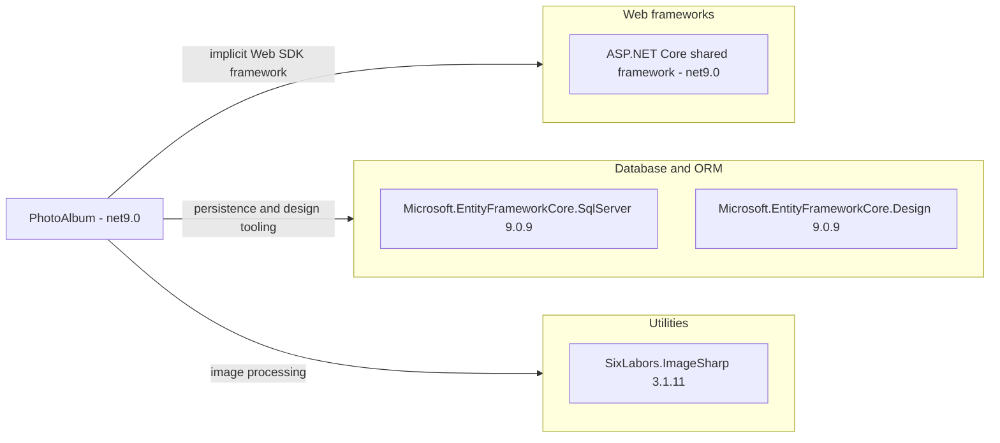

# Dependency Map

PhotoAlbum declares nine direct NuGet package references: three application dependencies and six test-scope dependencies. Its Web SDK also supplies an implicit ASP.NET Core shared framework; this is shown separately and not counted as a NuGet reference.

## Dependencies

### Dependency Summary

| Category | Count | Key Libraries | Notes |
|---|---|---|---|
| Web frameworks | 0 explicit packages; 1 implicit shared framework | ASP.NET Core, net9.0 | Web SDK and target framework; `PhotoAlbum/PhotoAlbum.csproj:1-6`. Exact runtime patch not pinned. |
| Database / ORM | 2 | Microsoft.EntityFrameworkCore.SqlServer 9.0.9; Microsoft.EntityFrameworkCore.Design 9.0.9 | SQL provider: application compile/runtime scope. Design package: development/build tooling, `PrivateAssets=all`, explicitly selected assets; `PhotoAlbum/PhotoAlbum.csproj:11-15`. |
| Utilities | 1 | SixLabors.ImageSharp 3.1.11 | Application compile/runtime package; `PhotoAlbum/PhotoAlbum.csproj:16`. |
| **Explicit application total** | **3** | Three unique PackageReference entries | Test packages excluded. |

### Version & Compatibility Risks

The application and tests target net9.0, with EF packages aligned at 9.0.9 (`PhotoAlbum/PhotoAlbum.csproj:4,11-16`, `PhotoAlbum.Tests/PhotoAlbum.Tests.csproj:4,12-13`). A framework upgrade must coordinate the web target, provider, design package and test host versions; ImageSharp compatibility and advisories require separate verification. Build manifests alone do not establish current support status, latest releases or CVE exposure, and this map does not claim an advisory scan.

### Notable Observations

- The solution has one application project and one test project; the tests reference the application, not a second deployable service (`PhotoAlbum.sln:6-9`, `PhotoAlbum.Tests/PhotoAlbum.Tests.csproj:23-25`).
- There are no Azure Blob, Azure Identity, messaging or cache packages among the application's three declared references (`PhotoAlbum/PhotoAlbum.csproj:10-17`). This is a declaration observation, not source-code analysis.
- No central package props, NuGet lockfile or packages.config was found in the build-file inventory; package versions are inline. Transitive packages, including SQL client details, cannot be accurately enumerated from these declarations alone.
- Vendored browser libraries and infrastructure module declarations are outside this build/package-only map; they are not inferred as NuGet dependencies.

## Test Dependencies

| Framework | Version | Notes |
|---|---|---|
| coverlet.collector | 6.0.2 | Coverage collector; `PhotoAlbum.Tests/PhotoAlbum.Tests.csproj:11`. |
| Microsoft.AspNetCore.Mvc.Testing | 9.0.9 | Web integration test host package; `PhotoAlbum.Tests/PhotoAlbum.Tests.csproj:12`. |
| Microsoft.EntityFrameworkCore.InMemory | 9.0.9 | Nonrelational test provider; `PhotoAlbum.Tests/PhotoAlbum.Tests.csproj:13`. |
| Microsoft.NET.Test.Sdk | 17.12.0 | Test discovery/execution; `PhotoAlbum.Tests/PhotoAlbum.Tests.csproj:14`. |
| xunit | 2.9.2 | Test framework; `PhotoAlbum.Tests/PhotoAlbum.Tests.csproj:15`. |
| xunit.runner.visualstudio | 2.8.2 | Runner integration; `PhotoAlbum.Tests/PhotoAlbum.Tests.csproj:16`. |

Total test-scope dependencies: 6

Scope is inferred from placement in the non-packable test project, not explicit NuGet scope metadata (`PhotoAlbum.Tests/PhotoAlbum.Tests.csproj:3-17`). The InMemory provider cannot establish SQL Server compatibility; no containerized database or contract-testing package is declared.
